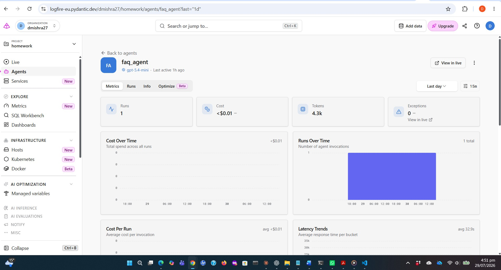
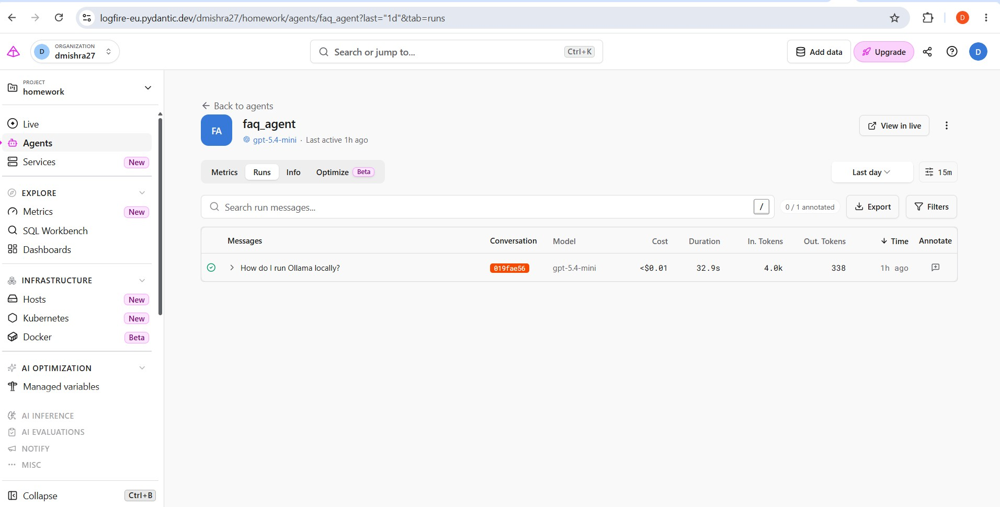
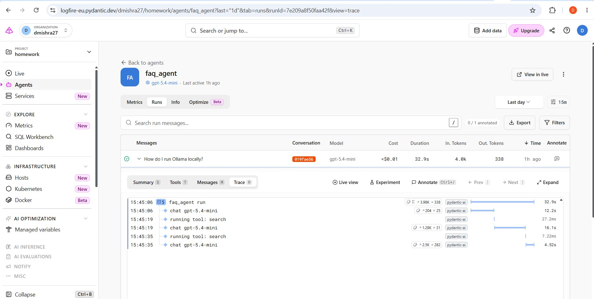
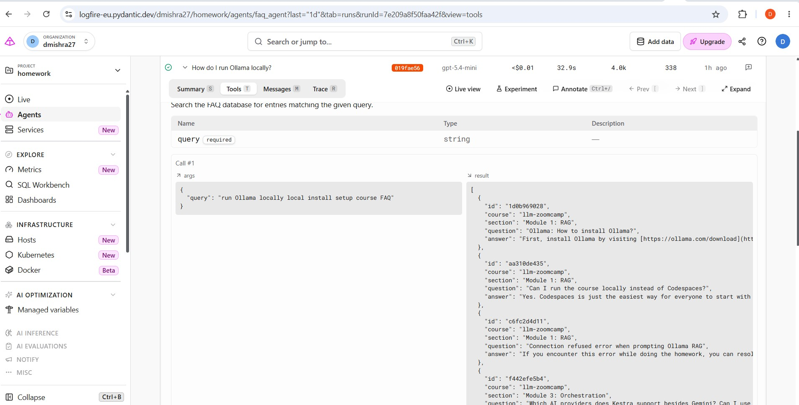
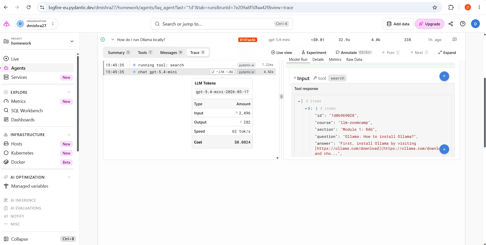
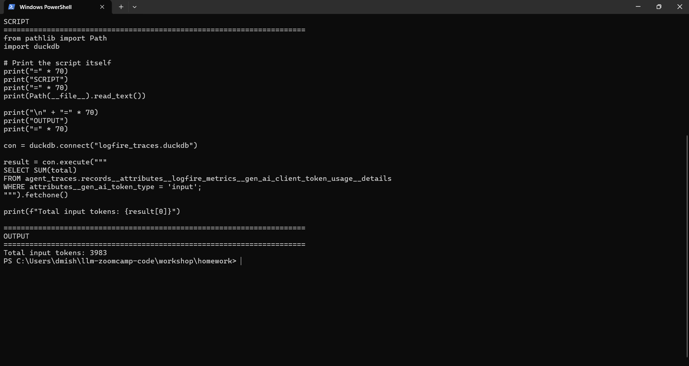

# Homework 5 – Monitoring with dlt and Logfire

## Overview

This project is part of the **LLM Zoomcamp 2026 – Homework 5 (Monitoring)**.

The objective of this homework is to build an AI agent, instrument it with Logfire for observability, export telemetry data using **dlt**, store the traces in **DuckDB**, and analyse execution metrics such as token usage.

---

## Objectives

- Build an AI agent using **Pydantic AI**
- Instrument the application with **Logfire**
- Capture execution traces and LLM metrics
- Export Logfire traces using **dlt**
- Store monitoring data in **DuckDB**
- Analyse token usage using SQL
- Verify homework answers programmatically

---

## Project Structure

```text
dlt_workshop/
├── agent.py
├── ingest.py
├── logfire_pipeline.py
├── main.py
├── db_table_count_check.py
├── verify_input_token_usage.py
├── pyproject.toml
├── uv.lock
├── .env.example
├── README.md
└── screenshots/
    ├── 01_agent_metrics_overview.jpg
    ├── 02_agent_runs.jpg
    ├── 03_expanded_run_trace.jpg
    ├── 04_search_tool_details.jpg
    ├── 05_llm_token_usage.png
    └── 06_duckdb_token_query.png
```

---

## Technology Stack

- Python
- Pydantic AI
- Logfire
- dlt
- DuckDB
- uv

---

## Monitoring Pipeline

```
User Query
      │
      ▼
Pydantic AI Agent
      │
      ▼
Logfire Instrumentation
      │
      ▼
Logfire Cloud
      │
      ▼
dlt Pipeline
      │
      ▼
DuckDB
      │
      ▼
SQL Analysis & Verification
```

---

## Homework Results

| Question | Result |
|-----------|--------|
| Q1 | **5** |
| Q2 | **24** (official expected answer) |
| Q3 | **1500–5000 input tokens** (SQL verification returned **3983**) |

---

## Screenshots

### 1. Agent Metrics Overview



---

### 2. Agent Runs



---

### 3. Expanded Run Trace



---

### 4. Search Tool Details



---

### 5. LLM Token Usage



---

### 6. DuckDB SQL Verification



---

## DuckDB Verification

The helper script queries the exported Logfire tables stored in DuckDB to verify the total number of input tokens consumed by the agent.

Example SQL:

```sql
SELECT SUM(total)
FROM agent_traces.records__attributes__logfire_metrics__gen_ai_client_token_usage__details
WHERE attributes__gen_ai_token_type = 'input';
```

Result:

```text
Total input tokens: 3983
```

This falls within the expected homework answer range (**1500–5000**).

---

## Running the Project

Create a virtual environment and install dependencies:

```bash
uv sync
```

Configure your Logfire credentials in `.env`.

Run the application:

```bash
uv run python main.py
```

Export Logfire traces:

```bash
uv run python ingest.py
```

Verify the homework answer:

```bash
uv run python db_table_count_check.py
```

---

## Key Learnings

This project demonstrates:

- AI application observability using Logfire
- Instrumentation of Pydantic AI agents
- Exporting telemetry using dlt
- Querying observability data with DuckDB
- SQL-based analysis of LLM token usage
- Verification of monitoring metrics through reproducible scripts

---

## Notes

The repository includes helper scripts used to inspect the DuckDB database and verify the homework results. The screenshots document the end-to-end monitoring workflow, including agent execution traces, tool calls, token usage, and SQL verification.